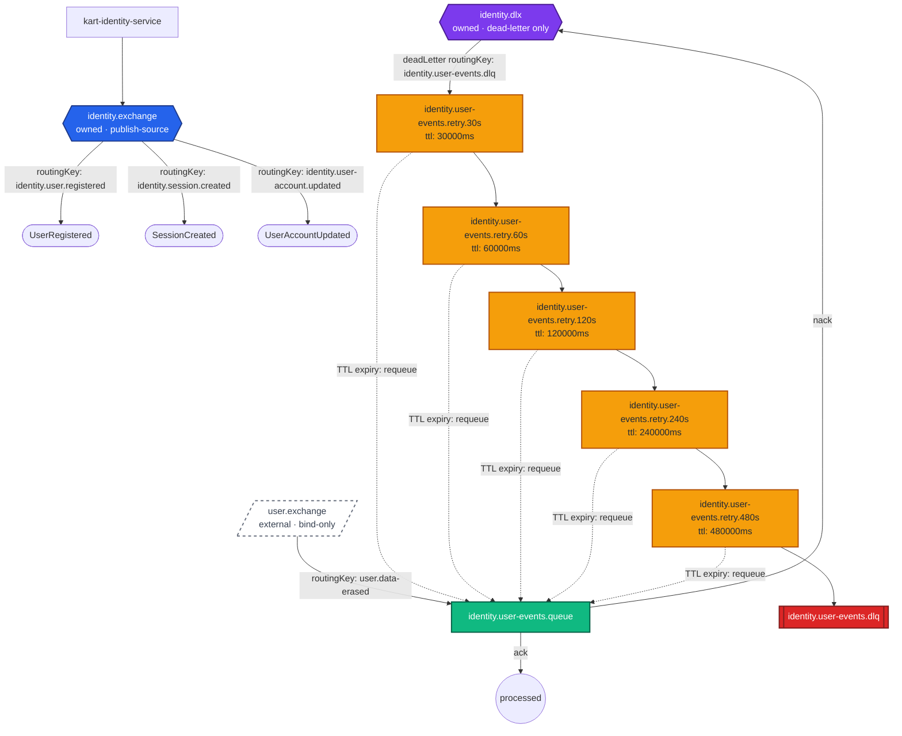

# kart-identity-service — Messaging Flow Diagram

Generated from [`message-bus-manifest.json`](./message-bus-manifest.json). Covers the full lifecycle:
publish fan-out, consume bindings, ack/nack branching, dead-letter routing, retry ladder escalation
(dashed TTL-expiry requeue back to the origin queue), and terminal DLQ parking.

Each exchange is labeled on two independent axes:
- **ownership**: owned by this service vs. external (bind-only, never declared here)
- **role**: publish source, dead-letter exchange (DLX), or bind-only

## Notes

- **`identity.exchange`** is owned and is a pure publish-source: all three domain events
  (`UserRegistered`, `SessionCreated`, `UserAccountUpdated`) are published to it, and no queue in
  this service binds back to it — identity does not self-consume its own events.
- **`identity.dlx`** is owned but is dead-letter-only — it never carries a published domain event,
  it only receives nacked messages from `identity.user-events.queue` and routes them into the
  5-tier retry ladder / terminal DLQ.
- **`user.exchange`** is external — owned by User Service, bind-only, never declared here.
  `identity.user-events.queue` binds to it on `user.data-erased` to drive GDPR erasure processing.
- The `identity.user-events.queue` retry ladder is the widest in the service: 5 tiers ascending
  30s → 60s → 120s → 240s → 480s, all requeuing back to `identity.user-events.queue` itself
  (per ADR-0016). After the 480s tier is exhausted the message parks in
  `identity.user-events.dlq`.
- Published domain events (`UserRegistered`, `SessionCreated`, `UserAccountUpdated`) have no DLQ of
  their own: the outbox relay retries indefinitely until RabbitMQ is reachable rather than
  dead-lettering.
